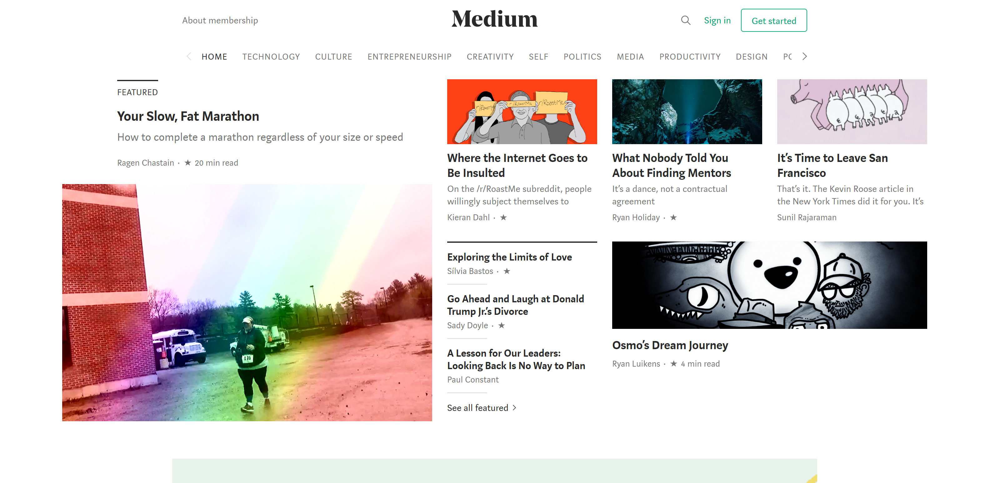

<h1 align="center">Pretty websites</h1>

Below are some websites I appreciate. They have nice design or nice organisation of content, or simply nice fonts. I made no effort to filter my selection based on their content or the companies behind them, I just looked at the design. If you have any to suggest, let me know.

### [blog.openai.com](https://blog.openai.com/)

> Great design of their in-depth blog posts, really nice _journal_-like feeling for their cover images which are also sometimes moving images - but never excessively so.

 

### [de wortel van drie](https://dwvd.nl/)

> Yes, they are web designers, so of course their website is pretty. But dwvd does things a little differently: just look at the overlapping elements, the slab font, the layout of the main page. To fully enjoy this website, you should visit it.

 

### [developer.mozilla.org](https://developer.mozilla.org)

> Sparse use of colour, bold headings, and an incredible amount of content make this website one of my favourites. Usually when I go here, it's because I am annoyed at some web programming issue, but I always leave refreshed. Perhaps a bit too much _design over function_, but I totally forgive it in this case.

 

### [GitHub](https://github.com)

> GitHub also belongs in this list for keeping an incredible number of features so clean. I like their use of colour to highlight important actions, such as the `new repository` button in the above screenshot. Also, subtle notifications are much better than in-your-face ones.

 

### [The Upshot](nytimes.com/section/upshot)

> The New York times website is beautiful overall, but _The Upshot_, the data visualisation section, is my favourite part. They have really consistent and consistently beautiful visualisations. Also, look at that pretty overhanging `SECTIONS` button in the top left.

 

 

### [Reaktor](https://www.reaktor.com/)

> Aside from its general clean aesthetic, one specific little detail about the Reaktor website caught my eye: hovering over a link makes it slide similar to the logo with its vertical shift. This is a great detail that really brings home the simple style!

 

 

### [Monotype](https://monotype.com)

> I love the main page of Monotype, which really invites you to try out different fonts interactively. Also, the soft background, small top-left wordmark and lack of separators give a calm feel with space for the fonts.

 

### [asn bank](https://www.asnbank.nl/home.html)

> ASN bank is a nice example of how a great logo, sparse use of colour and a beautiful font can together make a very traditional _menu bar_ layout really shine. Of course, a bank needs a traditional layout for accessibility, but that does not mean it needs to be [bootstrappy](https://getbootstrap.com/docs/4.0/examples/album/) like the rest of the internet.

 

### [Ace & Tate](https://www.aceandtate.com)

> Font, font, font. It's pretty. Also, I really like their recent redesign where they put the logo in the middle and make the ampersand (&) the divide between the left and right parts of the page. Great spacing of the elements, too.

 

### [Medium](https://medium.com)

> Although it is becoming a little too cluttered for my taste these days, the Medium website has always had fantastic visuals and a great font.

 

### [Berkshire Hathaway](http://berkshirehathaway.com/)

> An honorary mention goes out to Berkshire Hathaway, one of the most valuable investment companies in the world. They managed to keep their website largely the same since 1997 (!), as you can see on the [wayback machine](https://web.archive.org/web/19970530212007/http://www.berkshirehathaway.com:80/). The part I love most: _"If you have any comments about our WEB page, you can write us at the address shown above. However, due to the limited number of personnel in our corporate office, we are unable to provide a direct response."_

 

### 

>

 
